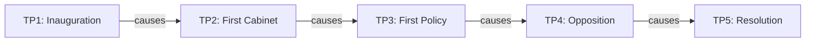

Timepoint Pro provides three training modes for populating entity knowledge states and simulating temporal evolution.

## Training Modes Overview

<CardGroup cols={3}>
  <Card title="train" icon="graduation-cap">
    Single-timepoint training with rich historical context
  </Card>
  <Card title="temporal_train" icon="clock">
    Multi-timepoint training with causal propagation
  </Card>
  <Card title="historical_training" icon="landmark">
    Context-aware training from predefined scenarios
  </Card>
</CardGroup>

## Basic Training Mode

Train entities at a single timepoint with historical context:

```bash
python cli.py mode=train
```

### Configuration

<ParamField path="training.graph_size" type="number" default="10">
  Number of entities to generate
</ParamField>

<ParamField path="training.target_resolution" type="string" default="SCENE">
  Resolution level for entities: `TENSOR_ONLY`, `SCENE`, `DIALOG`, or `FULL_CONTEXT`
</ParamField>

<ParamField path="seed" type="number">
  Random seed for reproducibility
</ParamField>

```yaml
training:
  graph_size: 10
  target_resolution: SCENE

seed: 42
```

### What It Does

1. **Creates Test Graph** - Generates a social network of entities
2. **Runs Training Workflow** - Uses LangGraph workflow to populate entities
3. **Populates Knowledge** - LLM generates:
   - Knowledge states (what entities know)
   - Energy budgets (resource constraints)
   - Personality traits
   - Temporal awareness
   - Confidence scores
4. **Saves to Database** - Persists entities with metadata
5. **Computes Metrics** - Calculates graph centrality and top entities

### Example Output

<CodeGroup>
```bash Terminal Output
Graph structure:
  Nodes: 10
  Edges: 15
  
Saving 10 entities to database...
  Saved: entity_001
  Saved: entity_002
  ...
  
Top 5 Most Central Entities:
  entity_005: 0.2891
  entity_001: 0.2456
  entity_003: 0.2103
  entity_007: 0.1987
  entity_002: 0.1654
  
Training complete: 0 violations
Total cost: $0.15
Tokens used: 1,245
```
</CodeGroup>

## Historical Training Mode

Train entities using predefined historical contexts:

```bash
python cli.py mode=train training.context=founding_fathers_1789
```

### Available Contexts

Historical scenarios are defined in `entity_templates.py`:

<Tabs>
  <Tab title="founding_fathers_1789">
    **Constitutional Inauguration** - April 30, 1789
    
    **Entities:**
    - George Washington (President-elect, age 57)
    - John Adams (Vice President-elect, age 53)
    - Thomas Jefferson (Secretary of State, age 45)
    - Alexander Hamilton (Treasury Secretary, age 34)
    - James Madison (Congressman, age 38)
    
    **Event:** First presidential inauguration
    
    **Relationships:** Political alliances, rivalries, and ideological bonds
  </Tab>
</Tabs>

### Configuration

<ParamField path="training.context" type="string">
  Historical context template name
  
  ```bash
  python cli.py mode=train training.context=founding_fathers_1789
  ```
</ParamField>

### What It Does

1. **Loads Historical Context** - Entity roles, ages, locations, relationships
2. **Creates Relationship Graph** - NetworkX graph with historical connections
3. **Enhanced LLM Prompts** - Context-aware entity population:
   - Historical role and responsibilities
   - Age and location at the time
   - Major event being witnessed
   - Relationships to other entities
4. **Records Exposure Events** - Tracks what each entity learned and when
5. **Saves Entities** - Persists to database with full metadata

### Example Output

<CodeGroup>
```bash Terminal Output
======================================================================
HISTORICAL CONTEXT: First Presidential Inauguration
Date: 1789-04-30T12:00:00
Entities: 5
======================================================================

Graph structure:
  Nodes: 5
  Edges: 8
  Relationships: ['political_alliance', 'ideological_bond', 'rivalry']

Populating entities with historical context...

  ✓ george_washington (President-elect)
    Age: 57, Location: Federal Hall, New York
    Knowledge items: 8
    Confidence: 0.95

  ✓ alexander_hamilton (Treasury Secretary)
    Age: 34, Location: Federal Hall, New York
    Knowledge items: 12
    Confidence: 0.92

Training complete!
Total cost: $0.0234
Tokens used: 1,567
```
</CodeGroup>

## Temporal Training Mode

Train entities across multiple timepoints with causal evolution:

```bash
python cli.py mode=temporal_train training.context=founding_fathers_1789 training.num_timepoints=5
```

### Configuration

<ParamField path="training.context" type="string">
  Historical context template
</ParamField>

<ParamField path="training.num_timepoints" type="number" default="5">
  Number of timepoints in the temporal chain
</ParamField>

```yaml
training:
  context: founding_fathers_1789
  num_timepoints: 5
```

### What It Does

1. **Builds Temporal Chain** - Creates sequence of causally-linked timepoints
2. **Saves Timepoints** - Persists timepoint data with:
   - Event descriptions
   - Timestamps
   - Resolution levels
   - Causal parent links
   - Entities present
3. **Processes Each Timepoint** - Sequential training:
   - Retrieves previous knowledge state (causal propagation)
   - Generates new knowledge based on current event
   - Updates entity metadata
   - Records exposure events for new information
4. **Validates Changes** - Runs validators on each update:
   - Temporal causality checks
   - Network flow validation
   - Behavioral inertia
5. **Compresses Tensors** - Applies tensor compression for storage efficiency

### Temporal Chain Structure

Timepoints are causally linked:



Each timepoint tracks:
- `causal_parent` - Previous timepoint ID
- `event_description` - What happened
- `timestamp` - When it occurred
- `entities_present` - Who was there
- `resolution_level` - Detail level

### Knowledge Propagation

Knowledge flows forward through the chain:

<Steps>
  <Step title="Timepoint 1">
    Entity starts with initial knowledge state from historical context
  </Step>
  <Step title="Timepoint 2">
    Entity learns new information from event
    
    Previous knowledge + New exposure = Updated knowledge state
  </Step>
  <Step title="Timepoint 3+">
    Knowledge accumulates across timepoints
    
    Only truly new knowledge is added (set difference)
  </Step>
</Steps>

### Example Output

<CodeGroup>
```bash Terminal Output
======================================================================
TEMPORAL TRAINING: founding_fathers_1789
Timepoints: 5
======================================================================

Building temporal chain...
Created 5 timepoints with causal links
  ✓ tp_001: Inauguration ceremony begins at Federal Hall...
  ✓ tp_002: George Washington takes the presidential oath...
  ✓ tp_003: First cabinet meeting convenes to discuss...
  ✓ tp_004: Hamilton presents economic policy proposal...
  ✓ tp_005: Jefferson expresses concerns about centralized...

Timepoint 1/5: tp_001
  Event: Inauguration ceremony begins at Federal Hall
  Timestamp: 1789-04-30 12:00:00
  Resolution: SCENE
  Entities: 5

  ✓ george_washington: +8 knowledge items
  ✓ john_adams: +6 knowledge items
  ✓ thomas_jefferson: +7 knowledge items
  ✓ alexander_hamilton: +9 knowledge items
  ✓ james_madison: +5 knowledge items

Timepoint 2/5: tp_002
  Event: George Washington takes the presidential oath
  Timestamp: 1789-04-30 12:15:00
  Resolution: DIALOG
  Entities: 5

  ✓ george_washington: +3 knowledge items
  ✓ john_adams: +2 knowledge items
  ✓ thomas_jefferson: +2 knowledge items
  ✓ alexander_hamilton: +4 knowledge items
  ✓ james_madison: +1 knowledge items

...

Temporal training complete!
Total cost: $0.1234
Timepoints processed: 5
```
</CodeGroup>

## Validation During Training

All training modes enforce validators (Mechanism 1.2):

<AccordionGroup>
  <Accordion title="Temporal Causality" icon="clock">
    Ensures knowledge can only come from past events, not future ones
    
    **Validates:**
    - Knowledge items have valid causal paths
    - No anachronistic information
    - Proper timepoint sequencing
  </Accordion>
  
  <Accordion title="Network Flow" icon="network-wired">
    Verifies information spreads through relationship graph
    
    **Validates:**
    - Knowledge flows along edges
    - No spontaneous knowledge generation
    - Social network constraints
  </Accordion>
  
  <Accordion title="Behavioral Inertia" icon="weight-hanging">
    Checks personality consistency over time
    
    **Validates:**
    - Personality traits remain stable
    - Character consistency
    - No sudden personality shifts
  </Accordion>
</AccordionGroup>

### Violation Handling

When violations occur:

```bash
⚠️  VALIDATION WARNING: george_washington - Knowledge item lacks causal path
⚠️  VALIDATION ERROR: thomas_jefferson - Anachronistic information detected
```

- **WARNING** - Logged but training continues
- **ERROR** - Logged; could block update (currently logs only)

## Tensor Compression

Temporal training applies tensor compression (Mechanism 1.1) for storage efficiency:

<Tabs>
  <Tab title="TENSOR_ONLY">
    **Maximum Compression**
    
    - Stores ONLY compressed representations
    - Removes full tensor data
    - Compression methods: PCA, SVD
    - Use for: Background entities, low-priority characters
  </Tab>
  
  <Tab title="SCENE+">
    **Hybrid Storage**
    
    - Keeps full tensor data
    - Also stores compressed version
    - Best of both worlds
    - Use for: Main characters, important entities
  </Tab>
</Tabs>

```python
# Compression applied automatically
compressed = {
    "context_pca": TensorCompressor.compress(context_tensor, "pca"),
    "context_svd": TensorCompressor.compress(context_tensor, "svd"),
    "biology_pca": TensorCompressor.compress(biology_tensor, "pca"),
    "behavior_pca": TensorCompressor.compress(behavior_tensor, "pca")
}
entity.entity_metadata["compressed"] = compressed
```

## Hydra Configuration

All training modes use Hydra for configuration management:

```yaml conf/config.yaml
mode: temporal_train

training:
  context: founding_fathers_1789
  num_timepoints: 5
  graph_size: 10
  target_resolution: SCENE

database:
  url: sqlite:///timepoint.db

llm:
  base_url: https://openrouter.ai/api/v1
  model: meta-llama/llama-3.1-70b-instruct

seed: 42
```

### Command-Line Overrides

```bash
# Override timepoint count
python cli.py mode=temporal_train training.num_timepoints=10

# Change context
python cli.py mode=train training.context=founding_fathers_1789

# Set resolution level
python cli.py mode=train training.target_resolution=DIALOG

# Change model
python cli.py mode=temporal_train llm.model=deepseek/deepseek-chat
```

## Cost Tracking

All training modes track costs:

```bash
Total cost: $0.1234
Tokens used: 1,567
```

**Typical costs:**
- Basic training (10 entities): $0.10-0.20
- Historical training (5 entities): $0.02-0.05
- Temporal training (5 timepoints): $0.10-0.25

## Next Steps

<CardGroup cols={2}>
  <Card title="Evaluate" icon="chart-bar" href="./evaluate">
    Run evaluation metrics on trained entities
  </Card>
  <Card title="Interactive Queries" icon="terminal" href="./interactive">
    Query your trained entities
  </Card>
  <Card title="Run Command" icon="play" href="./run">
    Execute full simulations
  </Card>
  <Card title="CLI Overview" icon="terminal" href="./overview">
    Back to CLI overview
  </Card>
</CardGroup>