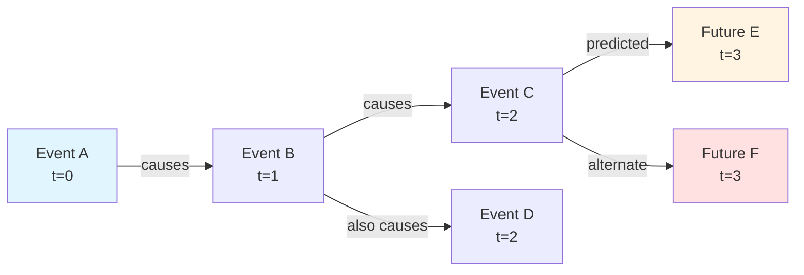
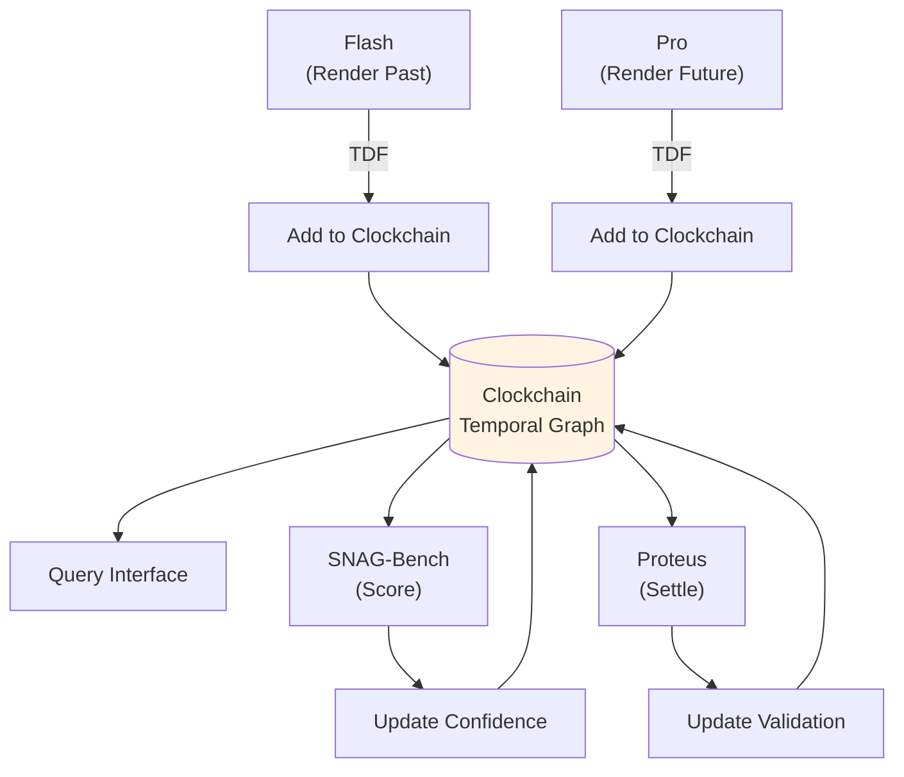
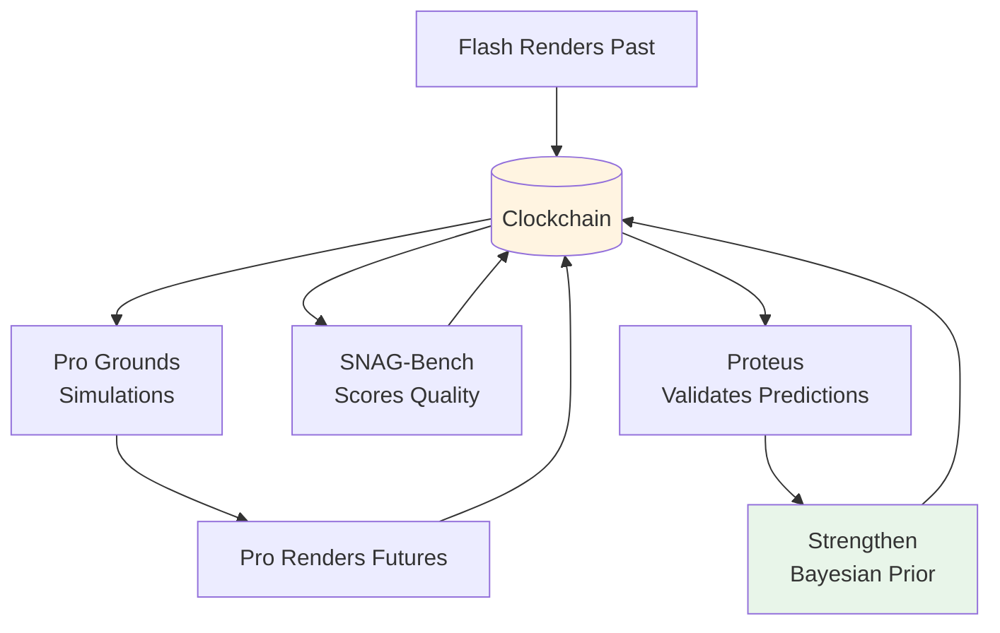

## Overview

Clockchain is the **Temporal Causal Graph** at the heart of the Timepoint Suite—an open-source database that stores both the **Rendered Past** (from Flash) and **Rendered Futures** (from Pro) in a unified, growing graph structure.

Unlike traditional blockchains that append transactions, Clockchain accumulates **causal edges** with temporal provenance, creating a living map of how events connect across time.

<Info>
  Clockchain is currently in development. This documentation describes its planned architecture and role in the suite.
</Info>

## What is a Temporal Causal Graph?

A **Temporal Causal Graph** is a data structure where:

- **Nodes** represent states (entities, events, knowledge at specific times)
- **Edges** represent causal relationships (X caused Y, A learned B from C)
- **Timestamps** order events with microsecond precision
- **Provenance** tracks the source and confidence of each edge
- **Branching** allows multiple futures and counterfactual pasts



### Rendered Past

**Historical states and causal paths grounded in evidence.**

Flash renders historical moments → TDF export → Clockchain stores as Rendered Past.

Properties:
- High confidence (grounded in historical records)
- Growing coverage (more moments rendered over time)
- Single timeline (though counterfactuals can branch)
- Immutable once validated

### Rendered Future

**Predicted states and causal paths from simulations.**

Pro simulations → TDF export → Clockchain stores as Rendered Futures.

Properties:
- Scored confidence (based on Causal Resolution)
- Multiple branches (different scenarios)
- Updated as reality unfolds
- Settled via Proteus prediction markets

## Architecture

### Core Data Structure

Clockchain stores temporal causal graphs with:

```typescript
interface CausalNode {
  id: string;
  timestamp: number;          // Unix microseconds
  type: "entity" | "event" | "knowledge";
  state: object;              // Entity state, event details, etc.
  provenance: Provenance;     // Source, confidence, rendering_id
  rendering_type: "past" | "future";
}

interface CausalEdge {
  id: string;
  source_node: string;
  target_node: string;
  relationship: "causes" | "enables" | "prevents" | "teaches";
  strength: number;           // 0.0 to 1.0
  confidence: number;         // 0.0 to 1.0
  provenance: Provenance;
}

interface Provenance {
  rendering_id: string;       // Flash or Pro run ID
  sources: string[];          // Historical docs or simulation configs
  validation_status: "unvalidated" | "validated" | "invalidated";
  snag_bench_score?: number;  // Causal Resolution
  proteus_settlement?: Settlement;
}
```

### Growing 24/7

Clockchain grows continuously:

1. **Flash renders historical moments** → new Rendered Past nodes
2. **Pro simulations** → new Rendered Future branches
3. **SNAG-Bench scores** → confidence updates
4. **Proteus settles predictions** → validation status updates
5. **Validated futures** → strengthen Bayesian priors



## Bayesian Prior

Clockchain maintains a **Bayesian prior** over causal relationships:

- **Initial prior**: Uniform or based on domain knowledge
- **Updates**: Each validated prediction strengthens relevant causal edges
- **Decay**: Old, unvalidated predictions decrease in weight
- **Convergence**: Multiple independent renderings that converge increase confidence

### Example: Learning from Validation

```
Rendered Future: "If board approves budget, launch succeeds"
  Initial confidence: 0.6 (based on simulation)
  SNAG-Bench score: 0.75 (high Causal Resolution)
  Proteus prediction: 65% of market bets "succeed"
  Reality: Launch succeeds
  
→ Clockchain updates:
  - "budget_approval → launch_success" edge strength: 0.6 → 0.78
  - Similar edges in other scenarios gain confidence
  - Future renderings use stronger prior
```

## Integration with Pro

### M20: Clockchain Grounding (Planned)

Pro will directly read from Clockchain to ground simulations:

```python
# Load historical context from Clockchain
context = clockchain.query(
    time_range=("2024-01-01", "2024-12-31"),
    entities=["CEO", "Board", "Investors"],
    depth=2  # Two hops of causal edges
)

# Run Pro simulation grounded in Rendered Past
config = SimulationConfig(
    scenario="corporate_pivot",
    grounding=context,
    mode=TemporalMode.FORWARD
)
result = run_simulation(config)

# Export Rendered Future back to Clockchain
tdf_records = from_pro(result)
clockchain.add_rendering(tdf_records, rendering_type="future")
```

### Benefits of Grounding

1. **No anachronisms**: Pro can't reference knowledge that didn't exist yet
2. **Causal consistency**: Simulations respect known historical causal paths
3. **Incremental rendering**: Continue from previous simulation endpoints
4. **Counterfactual branching**: Fork from verified historical pivots

## Query Interface

### Temporal Queries

```python
# Get all events at a specific time
events = clockchain.at(timestamp="2024-06-15T14:30:00Z")

# Get causal ancestors of an event
ancestors = clockchain.ancestors(
    node_id="board_vote_2024",
    max_depth=5
)

# Get all future branches from a node
futures = clockchain.futures(
    node_id="product_launch",
    confidence_threshold=0.7
)

# Causal path between two events
path = clockchain.path(
    source="funding_round",
    target="acquisition",
    max_length=10
)
```

### Convergence Queries

```python
# Find renderings that converged on similar causal structures
convergent = clockchain.find_convergent(
    scenario_type="corporate_crisis",
    jaccard_threshold=0.8,
    min_renderings=3
)

# Get Proof of Causal Convergence candidates
pocc_candidates = clockchain.pocc_candidates(
    time_range=("2024-01-01", "2024-12-31"),
    convergence_threshold=0.85,
    independent_renderings_min=5
)
```

## Proof of Causal Convergence (PoCC)

**PoCC is a future protocol concept**: rendering convergent causal paths constitutes useful work.

### How PoCC Works

1. **Multiple independent renderings** of the same historical/future moment
2. **Export to Clockchain** as separate rendering_ids
3. **Convergence detection**: Compare causal graphs using Jaccard similarity
4. **Validation**: High convergence (>0.85) across 5+ renderings → high confidence
5. **Reward**: Rendering work that contributes to convergence earns credit

### PoCC vs Proof of Work

| Aspect | Proof of Work (Bitcoin) | Proof of Causal Convergence |
|--------|------------------------|------------------------------|
| **Work** | Random hash searching | Causal graph rendering |
| **Validation** | First valid hash wins | Convergence across renderings |
| **Value** | Securing append-only log | Accumulating causal knowledge |
| **Output** | Wasted computation | Training data, predictions |
| **Scaling** | More miners → more energy | More renderers → better quality |

### Anchors for PoCC

**Pro and Clockchain** are the natural anchors:
- **Pro** generates renderings with full causal provenance
- **Clockchain** stores and detects convergence
- **SNAG-Bench** measures Causal Resolution (Coverage × Convergence)
- **Proteus** validates predictions against reality

## Timepoint Futures Index (TFI)

The planned **TFI** measures overall graph health:

```python
class TFI:
    """Timepoint Futures Index: measures Rendered Past coverage 
    and Rendered Future quality."""
    
    def calculate(self, clockchain: Clockchain) -> TFIScore:
        return TFIScore(
            past_coverage=self.rendered_past_coverage(clockchain),
            past_density=self.causal_edge_density(clockchain, "past"),
            future_coverage=self.rendered_future_coverage(clockchain),
            future_convergence=self.future_convergence_rate(clockchain),
            validation_rate=self.proteus_settlement_accuracy(clockchain),
            overall=self.composite_score(...)
        )
```

TFI dimensions:
- **Past Coverage**: % of historical timeline with renderings
- **Past Density**: Average causal edges per historical node
- **Future Coverage**: % of near-future timespan with predictions
- **Future Convergence**: Average Jaccard across multi-rendering scenarios
- **Validation Rate**: % of settled predictions that matched reality

## The Self-Reinforcing Flywheel

Clockchain sits at the center of the suite's flywheel:



1. **More Rendered Past** → better grounding → higher-quality simulations
2. **More Rendered Futures** → more validation opportunities
3. **More validation** → stronger Bayesian priors
4. **Stronger priors** → better future renderings
5. **Better renderings** → more valuable training data
6. **More training data** → better models → better renderings

**This is exponential value creation.**

## Implementation Status

<Info>
Clockchain is in active development. Core features planned for initial release:

- **TDF ingestion** from Flash and Pro
- **Graph storage** with temporal indexing
- **Query API** for temporal and causal queries
- **Confidence tracking** with Bayesian updates
- **Convergence detection** for PoCC
- **TFI calculation** for graph health metrics
</Info>

## Use Cases

<AccordionGroup>
  <Accordion title="Historical Grounding">
    Pro simulations load Rendered Past from Clockchain, ensuring no anachronisms and maintaining causal consistency with verified history.
  </Accordion>
  
  <Accordion title="Prediction Validation">
    Proteus queries Clockchain for Rendered Futures, creates prediction markets, and settles results back to update validation status.
  </Accordion>
  
  <Accordion title="Research Queries">
    Researchers can query causal paths: "What historical events led to X?" "What future scenarios include Y?" "What's the convergence rate for Z?"
  </Accordion>
  
  <Accordion title="Training Data Filtering">
    Filter TDF exports by Causal Resolution: only use renderings above threshold quality for model fine-tuning.
  </Accordion>
</AccordionGroup>

## Repository

Clockchain will be open-source, available at `github.com/timepoint-ai/timepoint-clockchain`.

## Next Steps

<CardGroup cols={2}>
  <Card title="SNAG-Bench Quality" icon="chart-line" href="/integration/snag-bench">
    Learn how SNAG-Bench measures Causal Resolution
  </Card>
  
  <Card title="Proteus Settlement" icon="handshake" href="/integration/proteus">
    See how Proteus validates Rendered Futures
  </Card>
  
  <Card title="Pro Integration" icon="network-wired" href="/core-concepts/mechanisms">
    Explore M20 Clockchain Grounding mechanism
  </Card>
  
  <Card title="Suite Overview" icon="layer-group" href="/integration/suite-overview">
    Return to the full Timepoint Suite overview
  </Card>
</CardGroup>