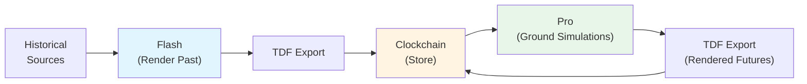
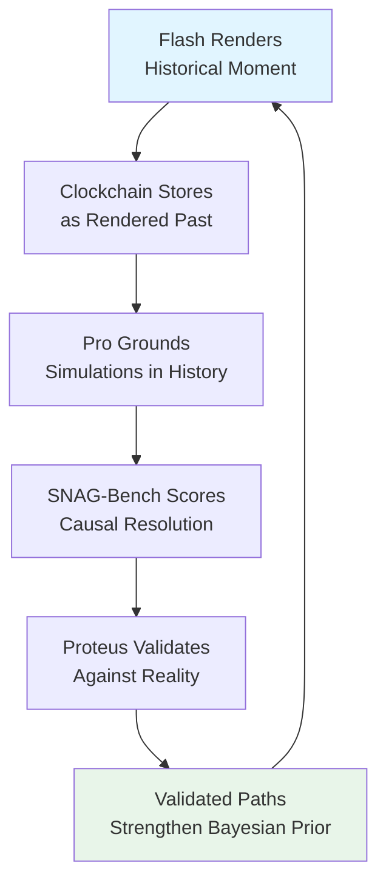

## Overview

Flash is the **Reality Writer** of the Timepoint Suite—an open-source engine that renders grounded historical moments through **Synthetic Time Travel**. Flash creates the foundation of the suite's flywheel by producing the **Rendered Past** that grounds all future simulations.

<Info>
  Flash is currently in development. This documentation describes its planned role in the Timepoint Suite ecosystem.
</Info>

## What is Synthetic Time Travel?

Synthetic Time Travel is the process of rendering specific historical moments with high fidelity by combining:

- **Historical records** (documents, transcripts, memoirs, news)
- **Contextual knowledge** (biographical data, cultural norms, geopolitical state)
- **Causal modeling** (what led to this moment, what made it pivotal)
- **Structured generation** (LLMs conditioned on verified context)

Unlike traditional historical analysis, Flash produces **structured causal graphs** with temporal provenance, not just narrative summaries.

## Core Capabilities

### Grounded Historical Rendering

Flash renders historical moments by:

1. **Loading verified historical context** from primary and secondary sources
2. **Building temporal context graphs** with entities, relationships, and states
3. **Generating dialog and interactions** grounded in documented evidence
4. **Tracking provenance** for every synthesized element
5. **Exporting to TDF** for integration with Clockchain

### Asymptotic Fidelity

The fidelity is **asymptotic**—we approach near-simulacrum on historical dialog because there are very few things a person *could* have said once the model has perfect context for that moment.

We'll never reach 1.0 fidelity, but we're at the steep end of the curve. The further we render the past, the stronger the Bayesian prior for rendering the future.

### Example Use Cases

<CardGroup cols={2}>
  <Card title="Diplomatic Moments" icon="handshake">
    Render the Yalta Conference with full context: Roosevelt's health, Stalin's strategy, Churchill's concerns.
  </Card>
  
  <Card title="Corporate Pivots" icon="building">
    Reconstruct the board meeting where Steve Jobs returned to Apple, grounded in documented accounts.
  </Card>
  
  <Card title="Scientific Breakthroughs" icon="flask">
    Render the moment Watson and Crick realized the DNA structure, with full lab context.
  </Card>
  
  <Card title="Crisis Response" icon="fire">
    Recreate the Apollo 13 mission control response with documented transcripts and technical context.
  </Card>
</CardGroup>

## Integration with the Suite

### Flash → Clockchain → Pro Pipeline



### The Rendered Past

Flash's output becomes the **Rendered Past** in Clockchain:

- **Entities**: Historical figures with full biographical context
- **Events**: Timestamped interactions with causal links
- **Knowledge**: What was known, by whom, when
- **Relationships**: Social graphs at specific moments
- **Provenance**: Source attribution for every fact

This Rendered Past serves as grounding for Pro simulations:
- **M20 Clockchain Grounding** (planned) will load this context
- Simulations can start from historical states
- Counterfactuals branch from verified moments
- Future projections build on documented history

## How Flash Works

### 1. Source Ingestion

Flash ingests historical sources:

```
Historical Documents
├── Primary sources (letters, transcripts, recordings)
├── Secondary sources (biographies, histories, analyses)
├── Metadata (dates, locations, participants)
└── Provenance (archival references, citations)
```

### 2. Context Graph Construction

Flash builds a temporal context graph:

- **Entities**: People, organizations, locations at specific dates
- **Relationships**: Who knew whom, power dynamics, conflicts
- **Knowledge**: What information existed, who had access
- **Causal links**: What events led to what outcomes

### 3. Rendering Pass

Flash generates structured outputs:

- **Dialog**: Conversations grounded in documented context
- **States**: Emotional, political, economic conditions
- **Decisions**: Choice points with causal consequences
- **Counterfactuals**: "What if" branches from historical pivots

### 4. TDF Export

All outputs export to TDF format for Clockchain storage:

```json
{
  "@context": "https://timepointai.com/tdf/1.0",
  "type": "RenderedMoment",
  "timestamp": "1945-02-11T14:30:00Z",
  "location": "Yalta, Crimea",
  "entities": [...],
  "dialog": [...],
  "causal_edges": [...],
  "provenance": {
    "sources": ["Yalta Conference Proceedings", ...],
    "confidence": 0.87
  }
}
```

## Synthetic Time Travel vs. Traditional History

| Aspect | Traditional History | Synthetic Time Travel (Flash) |
|--------|-------------------|-------------------------------|
| **Output** | Narrative text, analysis | Structured causal graphs |
| **Dialog** | Selected quotes | Full reconstructed conversations |
| **Provenance** | Footnotes, citations | Per-fact source attribution |
| **Counterfactuals** | Speculative narrative | Branching simulations |
| **Interoperability** | Human-readable only | TDF export, machine-readable |
| **Scope** | Single interpretation | Multiple renderings with convergence |

## Quality Metrics

### Source Coverage

**How much of the available historical record has been incorporated?**

- Primary source coverage percentage
- Cross-reference density (how many sources confirm each fact)
- Temporal completeness (gaps in the timeline)

### Causal Coherence

**Do the rendered events follow logical causal chains?**

- SNAG-Bench measures Causal Resolution
- Convergence across multiple renderings
- Consistency with documented outcomes

### Fidelity Score

**How closely does the rendering match verified historical facts?**

- Factual accuracy (dates, names, locations)
- Dialog plausibility (given documented speech patterns)
- Behavioral consistency (with known personality traits)

## The Self-Reinforcing Loop

Flash creates a self-reinforcing quality loop:



1. **More historical data** → better grounding for simulations
2. **More simulations** → more validation opportunities
3. **More validation** → stronger confidence in renderings
4. **Stronger confidence** → better future renderings

## Planned Features

### Multi-Source Reconciliation

When historical sources conflict:
- Generate multiple renderings representing different interpretations
- Track confidence scores based on source reliability
- Allow SNAG-Bench to evaluate convergence across versions

### Temporal Query Interface

```python
# Query Flash for a specific historical moment
moment = flash.render(
    date="1945-02-11",
    location="Yalta Conference",
    focus_entities=["Roosevelt", "Churchill", "Stalin"],
    depth="full"  # vs "summary"
)
```

### Incremental Rendering

Start with coarse coverage, refine on demand:
- Initial pass: major entities, key events
- Refinement: expand dialog, add supporting characters
- Deep dive: full context for critical moments

## Use Cases

<AccordionGroup>
  <Accordion title="Historical Research">
    Researchers can explore historical moments with full context, test counterfactual scenarios, and generate training data for historical AI models.
  </Accordion>
  
  <Accordion title="Educational Content">
    Create immersive historical experiences with structured data that preserves provenance and enables interactive exploration.
  </Accordion>
  
  <Accordion title="Grounding for Future Simulations">
    Pro simulations can start from verified historical states, ensuring future projections build on solid foundations.
  </Accordion>
  
  <Accordion title="Counterfactual Analysis">
    "What if FDR had lived longer?" "What if Churchill lost the 1945 election earlier?" Branch from Flash-rendered historical pivots.
  </Accordion>
</AccordionGroup>

## Repository

Flash will be open-source, available at `github.com/timepoint-ai/timepoint-flash`.

## Next Steps

<CardGroup cols={2}>
  <Card title="Clockchain Integration" icon="clock" href="/integration/clockchain">
    Learn how Clockchain stores Rendered Past and Rendered Future
  </Card>
  
  <Card title="Pro Grounding" icon="network-wired" href="/core-concepts/mechanisms">
    See how Pro uses historical context (M20 Clockchain Grounding)
  </Card>
  
  <Card title="Quality Validation" icon="chart-line" href="/integration/snag-bench">
    Understand SNAG-Bench's role in measuring Causal Resolution
  </Card>
  
  <Card title="Suite Overview" icon="layer-group" href="/integration/suite-overview">
    Return to the full Timepoint Suite overview
  </Card>
</CardGroup>