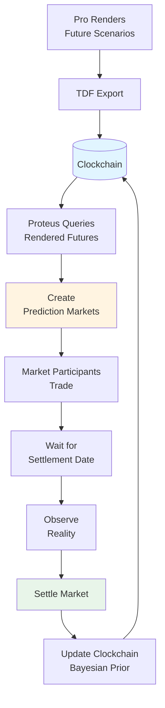
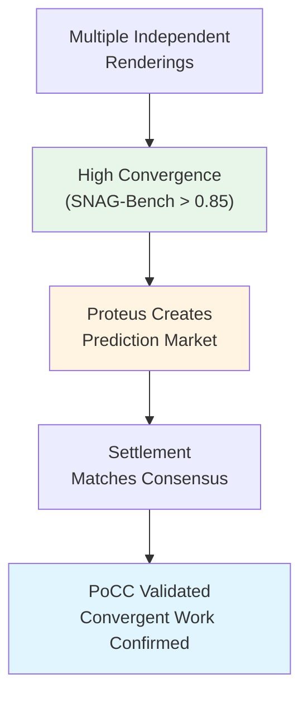
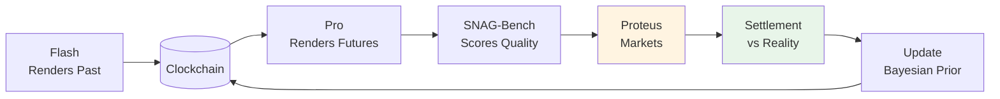

## Overview

Proteus is the **Settlement Layer** of the Timepoint Suite—an open-source prediction market platform that validates **Rendered Futures** from Pro simulations against reality.

Where Pro renders possible futures and SNAG-Bench scores their quality, Proteus answers: **"What actually happened?"**

<Info>
  Proteus is currently in development. This documentation describes its planned architecture and role in the suite.
</Info>

## What are Rendered Futures?

A **Rendered Future** is a scored, provenance-tracked causal subgraph—a structured projection of how the present connects to specific future states.

Example from a Pro simulation:

```json
{
  "scenario": "Series B funding round",
  "rendered_future": {
    "outcome": "funding_success",
    "causal_path": [
      {"event": "demo_success", "probability": 0.85},
      {"event": "term_sheet", "probability": 0.78},
      {"event": "due_diligence_pass", "probability": 0.82},
      {"event": "funding_close", "probability": 0.75}
    ],
    "snag_bench_score": 0.83,
    "convergence": 0.87,
    "provenance": {"rendering_id": "pro_run_12847"}
  }
}
```

Proteus creates prediction markets around these Rendered Futures, allowing market participants to validate (or challenge) the simulation's predictions.

## How Proteus Works

### 1. Market Creation

Proteus queries Clockchain for Rendered Futures:

```python
# Query high-quality Rendered Futures
futures = clockchain.query(
    rendering_type="future",
    snag_bench_score_min=0.75,
    time_range=(now, now + 90_days),
    settlement_pending=True
)

# Create prediction markets
for future in futures:
    market = proteus.create_market(
        question=future.outcome_description,
        resolution_criteria=future.resolution_criteria,
        settlement_date=future.predicted_timestamp,
        initial_probability=future.simulation_probability,
        provenance=future.rendering_id
    )
```

### 2. Market Participation

Participants can:

- **Buy YES shares**: Bet that the Rendered Future will occur
- **Buy NO shares**: Bet that it won't
- **Provide liquidity**: Earn fees by narrowing spreads
- **Update beliefs**: Prices adjust based on new information

### 3. Settlement

When the future date arrives:

```python
# Determine what actually happened
actual_outcome = observe_reality(market.resolution_criteria)

# Settle the market
settlement = proteus.settle_market(
    market_id=market.id,
    outcome=actual_outcome,
    evidence=verification_data
)

# Update Clockchain
clockchain.update_validation(
    rendering_id=market.provenance,
    validation_status="validated" if actual_outcome == predicted else "invalidated",
    proteus_settlement=settlement
)
```

### 4. Bayesian Prior Update

Clockchain uses settlement results to strengthen its Bayesian prior:

```python
# If the Rendered Future was correct
if settlement.outcome == predicted_outcome:
    # Strengthen causal edges in this path
    for edge in rendered_future.causal_path:
        clockchain.strengthen_edge(
            edge_id=edge.id,
            update=+0.05  # Bayesian update
        )
    
    # Similar edges in other scenarios gain confidence
    clockchain.propagate_confidence(
        template=edge.causal_pattern,
        boost=+0.02
    )
```

## Integration with the Suite

### The Validation Loop



### Flash → Pro → SNAG-Bench → Proteus → Clockchain

The full flywheel:

1. **Flash** renders grounded historical moments → Clockchain
2. **Pro** reads Rendered Past, simulates Rendered Futures → Clockchain
3. **SNAG-Bench** scores Causal Resolution → Clockchain confidence
4. **Proteus** creates markets, settles against reality → Clockchain validation
5. **Validated paths** strengthen Bayesian prior → all future renderings improve

## Market Types

### Binary Markets

**Simple yes/no outcomes.**

```
Question: "Will the board approve the $50M Series B term sheet by June 30?"
Resolution: YES (approved) or NO (rejected/delayed)
```

### Scalar Markets

**Numerical outcomes within a range.**

```
Question: "What will the company's ARR be on Dec 31, 2026?"
Resolution: Value between $5M and $25M
```

### Categorical Markets

**Multiple exclusive outcomes.**

```
Question: "Who will be CEO on Jan 1, 2027?"
Options:
- Current CEO remains (40%)
- Internal promotion (25%)
- External hire (20%)
- Company acquired/merged (15%)
```

### Conditional Markets

**Outcomes dependent on other events.**

```
Question: "IF the product launches by Q2, THEN will revenue exceed $10M in Q3?"
Resolution: Only settles if condition is met
```

## Quality Filters

Not all Rendered Futures become markets. Proteus applies filters:

### Minimum Causal Resolution

```python
# Only create markets for high-quality renderings
min_snag_bench_score = 0.75
min_convergence = 0.80
```

### Settlement Feasibility

```python
# Can we objectively determine the outcome?
if not future.has_clear_resolution_criteria:
    skip  # Too ambiguous

if future.settlement_date > now + 365_days:
    skip  # Too far in the future

if future.requires_private_info:
    skip  # Can't verify publicly
```

### Market Depth

```python
# Is there enough interest?
if estimated_participants < 10:
    skip  # Insufficient liquidity

if expected_volume < $1000:
    skip  # Not worth market creation costs
```

## Validation Signals

Proteus provides multiple validation signals back to Clockchain:

### 1. Market Price Signal

How much do participants agree with the simulation?

```python
simulation_probability = 0.75  # Pro's prediction
market_price = 0.68            # Current market consensus

# Signal strength
divergence = abs(simulation_probability - market_price)

if divergence < 0.10:
    signal = "high_agreement"  # Market validates simulation
elif divergence < 0.20:
    signal = "moderate_agreement"
else:
    signal = "low_agreement"   # Market doubts simulation
```

### 2. Settlement Outcome

Did the prediction match reality?

```python
if actual_outcome == predicted_outcome:
    validation = "correct_prediction"
    bayesian_update = +0.05  # Strengthen confidence
else:
    validation = "incorrect_prediction"
    bayesian_update = -0.03  # Decrease confidence
```

### 3. Calibration Metric

Are simulations well-calibrated?

```python
# Across many markets
predictions_70_percent = [m for m in markets if 0.6 < m.sim_prob < 0.8]
actual_success_rate = sum(m.outcome for m in predictions_70_percent) / len(...)

if 0.6 < actual_success_rate < 0.8:
    calibration = "well_calibrated"
else:
    calibration = "needs_recalibration"
```

## Proof of Causal Convergence (PoCC)

Proteus contributes to PoCC validation:



When multiple independent Pro renderings converge on the same causal structure (measured by SNAG-Bench), and Proteus markets validate that structure, it confirms useful work was done.

## Training Data Pipeline

Proteus-settled predictions create high-value training data:

```python
# Export validated predictions as training data
validated_renderings = clockchain.query(
    validation_status="validated",
    proteus_settled=True,
    snag_bench_score_min=0.80
)

# These renderings have:
# 1. High Causal Resolution (SNAG-Bench)
# 2. Market validation (Proteus price agreed)
# 3. Reality validation (Proteus settled correctly)
#
# → Highest-quality training data for causal reasoning

training_data = [to_training_format(r) for r in validated_renderings]
```

## Timepoint Futures Index (TFI)

Proteus contributes validation metrics to TFI:

```python
class TFI:
    def proteus_settlement_accuracy(self, clockchain: Clockchain) -> float:
        """What % of Proteus-settled predictions were correct?"""
        
        settled_markets = proteus.get_settled_markets()
        
        correct = sum(1 for m in settled_markets 
                      if m.outcome == m.predicted_outcome)
        
        return correct / len(settled_markets)
```

TFI tracks:
- Settlement accuracy (% correct)
- Calibration (predicted probabilities vs. actual frequencies)
- Market-simulation agreement (convergence between Pro and participants)

## The Self-Reinforcing Flywheel

Proteus closes the loop:



1. Better historical data → better simulations
2. Better simulations → more accurate markets
3. More accurate markets → validated training data
4. Validated training data → better models
5. Better models → better simulations

**Exponential value creation.**

## Implementation Status

<Info>
Proteus is in active development. Planned features:

- **Market creation** from Clockchain Rendered Futures
- **Binary, scalar, and categorical** market types
- **Settlement** with evidence verification
- **Bayesian updates** to Clockchain priors
- **Training data export** for validated predictions
- **TFI integration** for calibration metrics
</Info>

## Use Cases

<AccordionGroup>
  <Accordion title="Strategic Forecasting">
    Companies can validate Pro simulations of strategic decisions (product launches, funding rounds, pivots) via prediction markets.
  </Accordion>
  
  <Accordion title="Research Validation">
    Researchers can test hypotheses: run Pro simulations, create Proteus markets, settle against real-world outcomes.
  </Accordion>
  
  <Accordion title="Training Data Curation">
    Only use Proteus-validated Rendered Futures for fine-tuning: predictions that were both high-quality (SNAG-Bench) and correct (Proteus).
  </Accordion>
  
  <Accordion title="Model Calibration">
    Track Pro simulation accuracy over time via Proteus settlement data, adjusting model parameters for better calibration.
  </Accordion>
</AccordionGroup>

## Repository

Proteus will be open-source, available at `github.com/timepoint-ai/proteus`.

## Next Steps

<CardGroup cols={2}>
  <Card title="Clockchain Updates" icon="clock" href="/integration/clockchain">
    Learn how Proteus settlements strengthen Bayesian priors
  </Card>
  
  <Card title="SNAG-Bench Quality" icon="chart-line" href="/integration/snag-bench">
    See how quality filtering works before market creation
  </Card>
  
  <Card title="Rendered Futures" icon="network-wired" href="/core-concepts/rendered-futures">
    Understand what Pro exports as Rendered Futures
  </Card>
  
  <Card title="Suite Overview" icon="layer-group" href="/integration/suite-overview">
    Return to the full Timepoint Suite overview
  </Card>
</CardGroup>