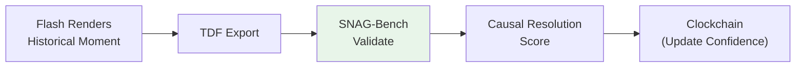
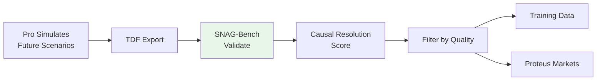
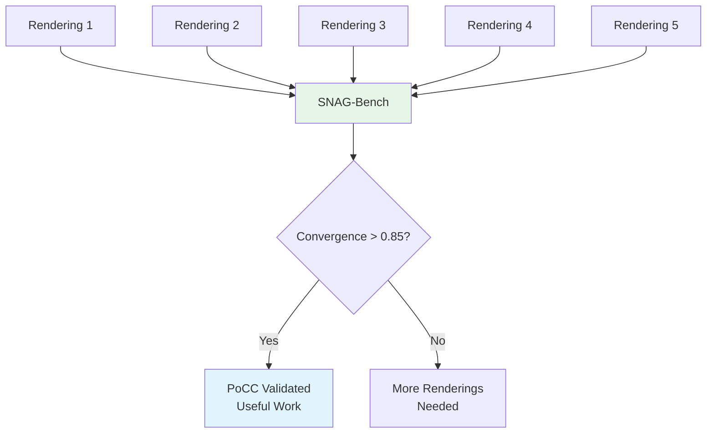

## Overview

SNAG-Bench is the **Quality Certifier** of the Timepoint Suite—an open-source validation framework that measures **Causal Resolution** across Flash and Pro renderings.

Where Flash renders history and Pro simulates futures, SNAG-Bench answers: **"How good is this rendering?"**

<Info>
  SNAG-Bench is currently in development. This documentation describes its planned architecture and role in the suite.
</Info>

## What is Causal Resolution?

**Causal Resolution = Coverage × Convergence**

The fundamental quality metric for temporal renderings:

### Coverage

**How much of a scenario has been rendered?**

- **Entity coverage**: What % of relevant entities have states?
- **Temporal coverage**: What % of timepoints are rendered?
- **Relationship coverage**: What % of entity pairs have relationship data?
- **Causal coverage**: What % of expected causal edges exist?

### Convergence

**How reliably do repeated runs converge on the same causal structure?**

- **Structural convergence**: Jaccard similarity of causal graphs
- **Entity convergence**: Consistency of entity states across runs
- **Dialog convergence**: Semantic similarity of generated conversations
- **Outcome convergence**: Agreement on final states

### Why It Matters

**High Causal Resolution means**:
- Simulations are comprehensive (coverage)
- Simulations are reliable (convergence)
- Training data is high-quality
- Predictions are trustworthy

**Low Causal Resolution indicates**:
- Missing critical entities or relationships (low coverage)
- Unstable simulation dynamics (low convergence)
- Insufficient grounding context
- Need for more rendering passes

## The Validation Framework

SNAG-Bench operates in two axes:

### Axis 1: Structural Validation

**Evaluate a single rendering's internal consistency.**

```python
from snag_bench import StructuralValidator

# Validate Pro simulation output
validator = StructuralValidator()
result = validator.validate(simulation_output)

print(result)
# {
#   "entity_coverage": 0.92,
#   "temporal_coverage": 0.88,
#   "causal_completeness": 0.85,
#   "knowledge_provenance": 0.91,
#   "temporal_consistency": 0.94,
#   "overall_coverage": 0.90
# }
```

**Checks include**:
- All entities have states at all timepoints
- All knowledge has provenance (M3)
- All causal edges have sources
- No temporal paradoxes (future knowledge in past)
- Relationship consistency over time

### Axis 2: Convergence Validation

**Compare multiple renderings of the same scenario.**

```python
from snag_bench import ConvergenceValidator

# Run same scenario 5 times
runs = [run_simulation(config) for _ in range(5)]

# Measure convergence
validator = ConvergenceValidator()
result = validator.validate(runs)

print(result)
# {
#   "causal_graph_jaccard": 0.87,
#   "entity_state_similarity": 0.83,
#   "dialog_semantic_similarity": 0.79,
#   "outcome_agreement": 0.92,
#   "overall_convergence": 0.85
# }
```

**Metrics include**:
- **Jaccard similarity** of causal edges
- **Cosine similarity** of entity state vectors
- **Semantic similarity** of dialog (via embeddings)
- **Outcome alignment** (final states match)

### Causal Resolution Score

```python
def causal_resolution(runs: List[SimulationOutput]) -> float:
    """Calculate Causal Resolution = Coverage × Convergence."""
    
    # Axis 1: Coverage (average across runs)
    coverage_scores = [StructuralValidator().validate(run) 
                       for run in runs]
    avg_coverage = mean([s.overall_coverage for s in coverage_scores])
    
    # Axis 2: Convergence (across all runs)
    convergence = ConvergenceValidator().validate(runs)
    overall_convergence = convergence.overall_convergence
    
    # Composite score
    return avg_coverage * overall_convergence
```

## Integration with the Suite

### Flash → SNAG-Bench

**Validate historical renderings:**



**Questions SNAG-Bench answers:**
- Is the historical record complete enough for this rendering?
- Do multiple renderings of the same event converge?
- What's the confidence level for this Rendered Past?

### Pro → SNAG-Bench

**Validate simulations and Rendered Futures:**



**Questions SNAG-Bench answers:**
- Is this simulation internally consistent?
- Do repeated runs converge on the same causal structure?
- Is this rendering high-quality enough for training data?
- Should we create prediction markets for this scenario?

## Benchmarking Causal Reasoning

SNAG-Bench also serves as a **benchmark for causal reasoning models**.

### Challenge Datasets

SNAG-Bench will include challenge datasets:

| Dataset | Source | Difficulty | Entities | Timepoints | Causal Edges |
|---------|--------|------------|----------|------------|--------------|
| **Historical Pivots** | Flash renderings | Hard | 5-10 | 10-20 | 30-60 |
| **Corporate Crises** | Pro simulations | Medium | 4-8 | 8-16 | 20-40 |
| **Multi-Agent Strategy** | Pro PORTAL mode | Hard | 6-12 | 12-24 | 40-80 |
| **Counterfactual Branches** | Pro BRANCHING mode | Expert | 8-16 | 16-32 | 60-120 |

### Evaluation Tasks

1. **Causal Path Prediction**: Given nodes A and C, predict intermediate node B
2. **Outcome Forecasting**: Given initial states, predict final states
3. **Knowledge Provenance**: Given entity knowledge, identify source and timing
4. **Temporal Consistency**: Detect anachronisms and causality violations
5. **Counterfactual Reasoning**: Given a branch point, predict alternate outcomes

### Leaderboard

Models will be ranked on:
- **Causal accuracy**: % of causal edges correctly predicted
- **Outcome accuracy**: % of final states correctly forecasted
- **Provenance accuracy**: % of knowledge sources correctly identified
- **Consistency score**: % of runs without temporal violations
- **Composite score**: Weighted average across all tasks

## Quality Gates for Training Data

SNAG-Bench enables quality filtering:

```python
# Filter Pro outputs for training data
def filter_for_training(runs: List[SimulationOutput], 
                        min_resolution: float = 0.8) -> List[SimulationOutput]:
    """
    Only use high-quality renderings for training.
    """
    filtered = []
    
    for run in runs:
        # Run SNAG-Bench validation
        coverage = StructuralValidator().validate(run).overall_coverage
        
        # Check convergence if multiple runs available
        if run.convergence_set:
            convergence = ConvergenceValidator().validate(
                run.convergence_set
            ).overall_convergence
        else:
            convergence = 1.0  # Assume convergent if no comparison
        
        # Calculate Causal Resolution
        resolution = coverage * convergence
        
        # Only include if above threshold
        if resolution >= min_resolution:
            filtered.append(run)
    
    return filtered
```

**Benefits:**
- **No low-quality data** polluting fine-tuning
- **Quantitative quality metrics** for dataset documentation
- **Confidence scores** for each training example
- **Convergence tracking** for reliability estimation

## The Asymptotic Fidelity Curve

**The fidelity is asymptotic**—we approach near-simulacrum on historical dialog because there are very few things a person *could* have said once the model has perfect context for that moment.

SNAG-Bench measures where we are on this curve:

```
Causal Resolution
    ^
1.0 |                    ........ (asymptote)
    |                ...
    |             ...
0.8 |          ...
    |       ...
    |     .
0.5 |   .
    | .
    +---------------------------------> Coverage
    0%  20%  40%  60%  80%  100%
```

- **Steep part of curve (0-60% coverage)**: Each new rendering adds significant value
- **Plateau (60-90%)**: Diminishing returns, but still improving
- **Asymptote (90%+)**: Near-simulacrum quality, but never perfect

**We'll never reach 1.0**, but we're at the steep end of the curve. The further we render, the stronger the Bayesian prior.

## Proof of Causal Convergence (PoCC)

SNAG-Bench is critical to PoCC:



Multiple independent renderings that converge (measured by SNAG-Bench) provide validation **without ground truth**.

## Timepoint Futures Index (TFI)

SNAG-Bench contributes to TFI calculation:

```python
class TFI:
    def calculate(self, clockchain: Clockchain) -> TFIScore:
        # Query all renderings from Clockchain
        past_renderings = clockchain.query(rendering_type="past")
        future_renderings = clockchain.query(rendering_type="future")
        
        # Run SNAG-Bench on each
        past_scores = [StructuralValidator().validate(r) 
                       for r in past_renderings]
        future_convergence = self._measure_future_convergence(
            future_renderings
        )
        
        return TFIScore(
            past_coverage=mean([s.overall_coverage for s in past_scores]),
            future_convergence=future_convergence,
            ...
        )
```

## Implementation Status

<Info>
SNAG-Bench is in active development. Planned features:

- **Axis 1 validators** for structural quality
- **Axis 2 validators** for convergence measurement
- **Challenge datasets** from Flash and Pro renderings
- **Leaderboard** for causal reasoning models
- **TDF integration** for automatic quality tagging
- **Clockchain integration** for confidence updates
</Info>

## Use Cases

<AccordionGroup>
  <Accordion title="Quality Assurance">
    Run SNAG-Bench on all Flash and Pro outputs to ensure high-quality renderings before adding to Clockchain.
  </Accordion>
  
  <Accordion title="Training Data Filtering">
    Only use renderings with Causal Resolution > 0.8 for model fine-tuning, ensuring clean, reliable training data.
  </Accordion>
  
  <Accordion title="Convergence Research">
    Study how many renderings are needed for convergence across different scenario types and complexity levels.
  </Accordion>
  
  <Accordion title="Model Benchmarking">
    Evaluate new causal reasoning models on SNAG-Bench challenge datasets and track progress on the leaderboard.
  </Accordion>
</AccordionGroup>

## Repository

SNAG-Bench will be open-source, available at `github.com/timepoint-ai/timepoint-snag-bench`.

## Next Steps

<CardGroup cols={2}>
  <Card title="Proteus Settlement" icon="handshake" href="/integration/proteus">
    See how Proteus validates predictions against reality
  </Card>
  
  <Card title="Clockchain Storage" icon="clock" href="/integration/clockchain">
    Learn how quality scores update Clockchain confidence
  </Card>
  
  <Card title="Training Data" icon="database" href="/examples/training-data">
    Explore how SNAG-Bench filters Pro training data
  </Card>
  
  <Card title="Suite Overview" icon="layer-group" href="/integration/suite-overview">
    Return to the full Timepoint Suite overview
  </Card>
</CardGroup>