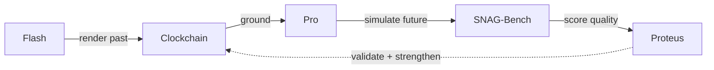
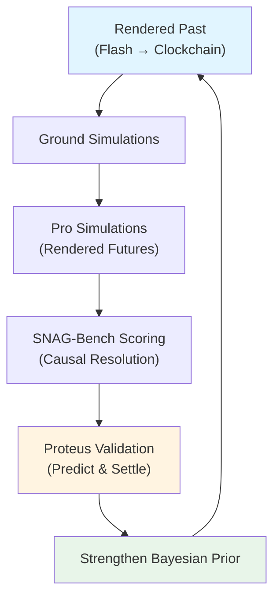

## The Timepoint Suite

The Timepoint Suite is a collection of open-source engines that work together to render, simulate, validate, and accumulate temporal causal graphs. The suite creates a self-reinforcing flywheel where historical renderings ground future simulations, quality scoring validates predictions, and settlement against reality strengthens the entire system.



## Core Services

### Open Source Engines

<CardGroup cols={2}>
  <Card title="Flash" icon="bolt" href="/integration/flash">
    **Reality Writer** — Renders grounded historical moments through Synthetic Time Travel
  </Card>
  
  <Card title="Pro" icon="network-wired" href="/getting-started/introduction">
    **Rendering Engine** — SNAG-powered social simulation with full causal provenance
  </Card>
  
  <Card title="Clockchain" icon="clock" href="/integration/clockchain">
    **Temporal Causal Graph** — Canonical storage for Rendered Past + Rendered Future
  </Card>
  
  <Card title="SNAG Bench" icon="chart-line" href="/integration/snag-bench">
    **Quality Certifier** — Measures Causal Resolution across renderings
  </Card>
  
  <Card title="Proteus" icon="handshake" href="/integration/proteus">
    **Settlement Layer** — Prediction markets that validate Rendered Futures
  </Card>
  
  <Card title="TDF" icon="file-code">
    **Data Format** — JSON-LD interchange format across all services
  </Card>
</CardGroup>

### Private Services

| Service | Role | Status |
|---------|------|--------|
| **Web App** | Browser client at app.timepointai.com | Private |
| **iPhone App** | iOS client for Synthetic Time Travel | Private |
| **Billing** | Payment processing (Apple IAP + Stripe) | Private |
| **Landing** | Marketing site at timepointai.com | Private |

## How Pro Integrates

### TDF Export

Timepoint Pro exports all simulation outputs in **TDF (Timepoint Data Format)**, a JSON-LD interchange format that enables seamless integration with the broader suite:

```python
from timepoint_tdf import from_pro, write_tdf_jsonl

# Export simulation run to TDF
payload = {
    "entities": entities,
    "dialogs": dialogs,
    "causal_edges": causal_edges,
    "metadata": metadata
}
tdf_records = from_pro(payload)
write_tdf_jsonl(tdf_records, "output.tdf.jsonl")
```

The `/api/data-export/{run_id}` endpoint returns the full payload ready for TDF conversion.

### Training Data Pipeline

Pro generates high-quality training data with full causal ancestry:

1. **Rich Context**: Every dialog turn includes M3 knowledge provenance, M6 entity state, M7 causal history, M10 atmosphere, M11 dialog context, and M13 relationships
2. **Causal Provenance**: Full ancestry tracking ensures no "magic knowledge"
3. **Counterfactual Branches**: BRANCHING mode generates multiple timeline variations
4. **Convergence Sets**: Repeated runs provide reliability metrics without ground truth

Training data flows to:
- **SNAG-Bench Axis 2**: Causal reasoning benchmarks
- **Proteus**: Simulation-to-training pipeline
- **Fine-tuning**: Causal/temporal/multi-agent reasoning models

### Rendered Futures

A **Rendered Future** is a scored, provenance-tracked causal subgraph—a structured projection of how the present connects to specific future states.

Pro reads the Clockchain's **Rendered Past** as grounding and produces **Rendered Futures** as TDF records:

1. **Flash** renders historical moments → stores in **Clockchain**
2. **Pro** reads Rendered Past as context → simulates near-future causal paths
3. **SNAG-Bench** scores Causal Resolution (Coverage × Convergence)
4. **Proteus** validates predictions against reality
5. **Clockchain** strengthens its Bayesian prior with validated paths
6. All future renderings improve

## Key Concepts

### Causal Resolution

**Causal Resolution = Coverage × Convergence**

- **Coverage**: How much of a scenario has been rendered?
- **Convergence**: How reliably do repeated runs converge on the same causal structure?

The fidelity is asymptotic—we approach near-simulacrum on historical dialog because there are very few things a person *could* have said once the model has perfect context for that moment.

### Proof of Causal Convergence (PoCC)

**PoCC** is a future protocol concept: rendering convergent causal paths constitutes useful work.

Multiple independent renderings that converge on the same causal structure provide a form of validation without ground truth. Pro and Clockchain are the natural anchors for this protocol.

### Timepoint Futures Index (TFI)

The planned **TFI** will measure:
- Rendered Past coverage across the temporal graph
- Rendered Future quality and convergence metrics
- Overall system health and prediction accuracy

## The Self-Reinforcing Flywheel

The suite creates exponential value through its feedback loops:



1. **More historical data** → better grounding → higher-quality simulations
2. **More simulations** → more training data → better causal reasoning
3. **More validation** → stronger priors → improved future predictions
4. **More convergence** → higher confidence → more reliable forecasting

## Architecture Philosophy

### Isolation by Design

Timepoint Pro is a **standalone simulation engine**:
- No runtime dependencies on other suite services
- All LLM calls go directly to OpenRouter
- All data stays in local SQLite + flat files
- Fully forkable and self-contained

This isolation ensures:
- Anyone with an OpenRouter key can run the full pipeline
- Community contributions don't require access to private services
- Research and experimentation remain friction-free

### Planned: M20 Clockchain Grounding

Future integration will anchor simulations in the canonical temporal graph stored in Clockchain. This mechanism will:
- Load Rendered Past as context for simulations
- Prevent anachronisms by checking temporal consistency
- Enable cross-simulation causal linkage
- Support incremental rendering (continuing from previous states)

## Use Cases Across the Suite

<AccordionGroup>
  <Accordion title="Strategic Foresight">
    Use Pro's PORTAL mode to map critical paths backward from desired outcomes ("$1B exit", "colony survives", "election won"). SNAG-Bench validates the causal coherence. Proteus settles predictions against reality.
  </Accordion>
  
  <Accordion title="Historical Research">
    Flash renders grounded historical moments. Pro simulates counterfactual branches. SNAG-Bench measures convergence across interpretations. Results accumulate in Clockchain as Rendered Past.
  </Accordion>
  
  <Accordion title="Training Data Generation">
    Pro generates simulations with full causal provenance. SNAG-Bench filters by quality. Training data flows to fine-tuning pipelines and research benchmarks.
  </Accordion>
  
  <Accordion title="Prediction Markets">
    Pro renders multiple future scenarios. SNAG-Bench scores their causal resolution. Proteus creates prediction markets. Settlements strengthen Clockchain's priors.
  </Accordion>
</AccordionGroup>

## The Timepoint Thesis

A forthcoming paper will formalize:
- The Rendered Past / Rendered Future framework
- The mathematics of Causal Resolution
- The TDF specification
- The Proof of Causal Convergence protocol

Follow [@seanmcdonaldxyz](https://x.com/seanmcdonaldxyz) for updates.

## Next Steps

<CardGroup cols={2}>
  <Card title="Explore Flash" icon="bolt" href="/integration/flash">
    Learn how Flash renders grounded historical moments
  </Card>
  
  <Card title="Understanding Clockchain" icon="clock" href="/integration/clockchain">
    Discover the temporal causal graph architecture
  </Card>
  
  <Card title="Quality with SNAG-Bench" icon="chart-line" href="/integration/snag-bench">
    See how Causal Resolution measures rendering quality
  </Card>
  
  <Card title="Settlement via Proteus" icon="handshake" href="/integration/proteus">
    Understand prediction market validation
  </Card>
</CardGroup>