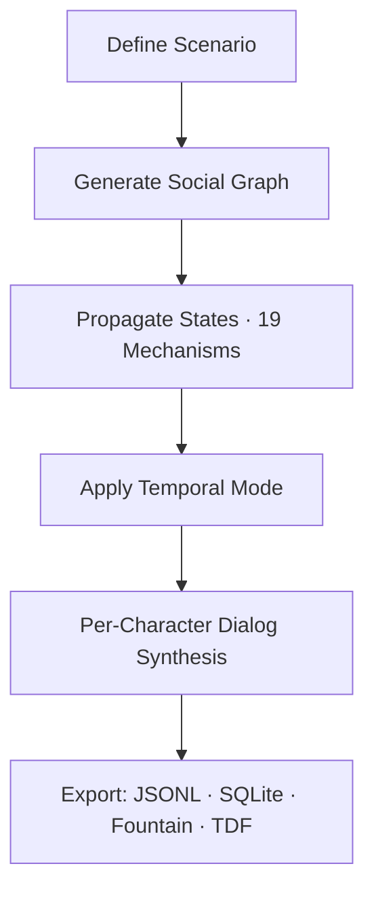

# Timepoint Pro

**Synthetic time travel through social simulation.**

**The first practical SNAG engine: Social Network Augmented Generation.**

Like RAG retrieves documents to ground generation, SNAG synthesizes and maintains a structured social graph—complete with causal provenance, knowledge flow, emotional states, and temporal consistency—to ground LLM generation in complex group dynamics.

This transforms LLMs from fragile, drifting storytellers into reliable multi-agent reasoners. Naive single-prompt simulations collapse beyond ~10 entities or ~20 interactions due to inconsistency and token explosion. SNAG's structured propagation, variable-depth fidelity, and composable mechanisms let you scale to dozens of entities across hundreds of timepoints—while keeping costs low and causality auditable.

<CardGroup cols={2}>
  <Card title="Quick Start" icon="rocket" href="/quickstart">
    Get up and running in 5 minutes
  </Card>
  <Card title="Core Concepts" icon="brain" href="/concepts/snag">
    Understand SNAG and temporal modes
  </Card>
  <Card title="API Reference" icon="code" href="/cli/overview">
    Explore the CLI and Python API
  </Card>
  <Card title="Examples" icon="flask" href="/examples/mars-mission">
    See real simulation scenarios
  </Card>
</CardGroup>

## Why SNAG Matters

|                        | RAG                          | SNAG (Timepoint Pro)                           |
|------------------------|------------------------------|------------------------------------------------|
| **Grounds LLMs in**   | Retrieved documents          | Synthesized social graphs                      |
| **Maintains**          | Document relevance           | Causal provenance + temporal consistency        |
| **Scales to**          | Millions of documents        | Dozens of entities, hundreds of timepoints      |
| **Output**             | Grounded answers             | Auditable causal simulations + training data    |

The value is exponential with scale: the larger and more intricate the social system (board + investors + competitors, colony crew + Earth command, historical delegations), the more emergent behaviors surface that intuition or simple models miss.

<Note>
**Cost-effective at scale**: $0.15–$1.00 per simulation run. All 21 templates verified February 2026.
</Note>

## Key Features

<CardGroup cols={3}>
  <Card title="Five Temporal Modes" icon="clock">
    FORWARD, PORTAL, BRANCHING, CYCLICAL, DIRECTORIAL—each with unique causal semantics
  </Card>
  <Card title="Heterogeneous Fidelity" icon="layer-group">
    95% cost reduction: entities scale from TENSOR_ONLY (~200 tokens) to TRAINED (~50k tokens)
  </Card>
  <Card title="Knowledge Provenance" icon="sitemap">
    Track who learned what, from whom, when—with exposure events and causal audit trails
  </Card>
  <Card title="Dialog Synthesis" icon="comments">
    Per-character generation with voice discipline, archetype profiles, and naturalness scoring
  </Card>
  <Card title="19 Mechanisms" icon="gears">
    Composable building blocks for fidelity, temporal reasoning, knowledge tracking, and more
  </Card>
  <Card title="Training Data Export" icon="database">
    TDF, JSONL, SQLite, Fountain formats—ready for fine-tuning and ML pipelines
  </Card>
</CardGroup>

## Architecture Overview



## Temporal Modes

<AccordionGroup>
  <Accordion title="FORWARD — Strict causality">
    Standard forward timeline with knowledge provenance. Entities only know what they've witnessed or been told.
  </Accordion>
  <Accordion title="PORTAL — Backward reasoning">
    Start from a target outcome (mission failure, election won) and work backward to discover critical paths and pivot points.
  </Accordion>
  <Accordion title="BRANCHING — Counterfactuals">
    Explore "what-if" scenarios with divergent timelines. Run multiple survival strategies, pitch outcomes, or decision paths.
  </Accordion>
  <Accordion title="CYCLICAL — Prophecy loops">
    Future constrains past. Perfect for mythic sagas, generational stories, and bootstrap paradoxes.
  </Accordion>
  <Accordion title="DIRECTORIAL — Dramatic tension">
    Five-act structure with camera system. Events driven by narrative arc rather than pure causality.
  </Accordion>
</AccordionGroup>

## Flagship Examples

| Template                    | Mode      | Key Feature                          | Entities | Timepoints | Cost   |
|-----------------------------|-----------|--------------------------------------|----------|------------|--------|
| mars_mission_portal         | PORTAL    | Backward reasoning from 2031 failure | 4        | 6          | ~$0.18 |
| castaway_colony_branching   | BRANCHING | Counterfactual survival strategies   | 8        | 16         | ~$0.35 |
| vc_pitch_branching          | BRANCHING | Investor reactions across pitches    | 5        | 16         | ~$0.30 |

## Use Cases

<CardGroup cols={2}>
  <Card title="Strategic Foresight" icon="chess">
    PORTAL maps critical paths backward from any outcome
  </Card>
  <Card title="Decision Testing" icon="flask-vial">
    Run scenarios multiple ways, measure causal convergence
  </Card>
  <Card title="Training Data" icon="graduation-cap">
    Full causal ancestry, provenance, counterfactuals baked in
  </Card>
  <Card title="Social Forecasting" icon="chart-line">
    Variable-depth fidelity: low-res for long horizons, high-res at pivots
  </Card>
</CardGroup>

## Quick Installation

<CodeGroup>

```bash pip
pip install -r requirements.txt
export OPENROUTER_API_KEY=your_key
```

```bash poetry
poetry install
export OPENROUTER_API_KEY=your_key
```

</CodeGroup>

```bash Run your first simulation
./run.sh list                            # View all templates
./run.sh run mars_mission_portal         # PORTAL: backward from failed mission
./run.sh run castaway_colony_branching   # Full mechanisms + counterfactuals
```

<Info>
Python 3.10+ required. OpenRouter API key needed for LLM access.
</Info>

## Timepoint Suite Integration

Timepoint Pro is part of the open-source Timepoint Suite for temporal AI:

- **Flash** — Reality Writer: renders grounded historical moments
- **Pro** — SNAG simulation engine (this project)
- **Clockchain** — Temporal Causal Graph: Rendered Past + Rendered Future
- **SNAG Bench** — Quality certifier: measures Causal Resolution
- **Proteus** — Settlement layer: prediction markets for Rendered Futures
- **TDF** — Data format: JSON-LD interchange across all services

<Card title="Learn more about the Timepoint Suite" icon="puzzle-piece" href="/integration/suite-overview">
  Explore how Pro integrates with Flash, Clockchain, and other services
</Card>

## Next Steps

<CardGroup cols={2}>
  <Card title="Quickstart Guide" icon="play" href="/quickstart">
    Run your first simulation in 5 minutes
  </Card>
  <Card title="Understanding SNAG" icon="book" href="/concepts/snag">
    Learn the core architecture and philosophy
  </Card>
  <Card title="Temporal Modes Deep Dive" icon="timeline" href="/concepts/temporal-modes">
    Master FORWARD, PORTAL, BRANCHING, and more
  </Card>
  <Card title="19 Mechanisms" icon="gear" href="/mechanisms/overview">
    Explore the composable building blocks
  </Card>
</CardGroup>

---

<Note>
**Open Source** — Apache 2.0 License · [GitHub](https://github.com/timepoint-ai/timepoint-pro) · [@seanmcdonaldxyz](https://x.com/seanmcdonaldxyz)
</Note>
