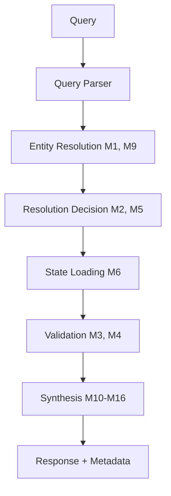

## The Core Problem

LLM-based simulations face a fundamental tension: full-fidelity simulation is prohibitively expensive (O(entities × timepoints × tokens)) and causes context collapse, but naive compression destroys causal structure. You can't reason about "what did Jefferson know when he wrote this letter" if you've summarized away the exposure events that gave him that knowledge.

Traditional approaches assume **uniform fidelity**—every entity at every moment rendered at the same resolution. This is wasteful (most detail is never queried) and inflexible (no way to dynamically allocate detail where it matters).

## The Architectural Insight

Timepoint-Pro treats **fidelity as a query-driven 2D surface** over (entity, timepoint) space. Resolution is heterogeneous and mutable: a minor attendee exists as a 200-token tensor embedding until someone asks about them, at which point the system elevates their resolution while preserving causal consistency with everything already established.

This enables **95% cost reduction** without temporal incoherence—but only because the system maintains explicit causal structure (exposure events, temporal chains, validation constraints) that compression-based approaches discard.

## The Five Pillars

The 19 mechanisms group into five architectural pillars:

| Pillar | Problem | Mechanisms |
|--------|---------|------------|
| **Fidelity Management** | Allocate detail where queries land | M1, M2, M5, M6 |
| **Temporal Reasoning** | Multiple notions of time and causality | M7, M8, M12, M14, M17 |
| **Knowledge Provenance** | Track who knows what, from whom, when | M3, M4, M19 |
| **Entity Simulation** | Generate and synthesize entity behavior | M9, M10, M11, M13, M15, M16 |
| **Infrastructure** | Model selection, cost optimization | M18 |

## Complete Mechanism Table

<AccordionGroup>
  <Accordion title="Fidelity Management (M1, M2, M5, M6)">
    
| ID | Mechanism | Purpose | Token Impact |
|----|-----------|---------|-------------|
| **M1** | Heterogeneous Fidelity Graphs | Each (entity, timepoint) maintains independent resolution | 95% reduction |
| **M2** | Progressive Training | Entity quality accumulates with queries | Lazy quality investment |
| **M5** | Query-Driven Lazy Resolution | Resolution decisions at query time, not simulation time | Pay only for what's queried |
| **M6** | TTM Tensor Compression | Structured tensor representation at TENSOR_ONLY resolution | 97% compression ratio |

  </Accordion>
  
  <Accordion title="Temporal Reasoning (M7, M8, M12, M14, M17)">
    
| ID | Mechanism | Purpose | Key Feature |
|----|-----------|---------|-------------|
| **M7** | Causal Temporal Chains | Explicit causal links between timepoints | Prevents anachronisms |
| **M8** | Vertical Timepoint Expansion | Add detail within a moment (not just forward) | Intra-moment depth |
| **M12** | Counterfactual Branching | Create alternate timelines from intervention points | "What if" analysis |
| **M14** | Circadian Activity Patterns | Time-of-day behavior probability | Natural scheduling |
| **M17** | Modal Temporal Causality | Five temporal modes with different causal semantics | FORWARD, PORTAL, BRANCHING, DIRECTORIAL, CYCLICAL |

  </Accordion>
  
  <Accordion title="Knowledge Provenance (M3, M4, M19)">
    
| ID | Mechanism | Purpose | Key Insight |
|----|-----------|---------|-------------|
| **M3** | Exposure Event Tracking | Log every knowledge acquisition | Knowledge has origins |
| **M4** | Constraint Enforcement | Five validators using conservation laws | Structural consistency |
| **M19** | Knowledge Extraction Agent | LLM-based semantic extraction from dialog | No magic knowledge |

  </Accordion>
  
  <Accordion title="Entity Simulation (M9, M10, M11, M13, M15, M16)">
    
| ID | Mechanism | Purpose | Key Feature |
|----|-----------|---------|-------------|
| **M9** | On-Demand Entity Generation | Generate entities when queries reference them | Lazy entity creation |
| **M10** | Scene-Level Entity Sets | Environment, Atmosphere, Crowd entities | Context shapes behavior |
| **M11** | Dialog Synthesis | Per-character turn generation with LangGraph | Voice differentiation |
| **M13** | Multi-Entity Synthesis | Relationship evolution tracking | Belief alignment over time |
| **M15** | Entity Prospection | Entities model their own futures | Planning and anxiety |
| **M16** | Animistic Entity Extension | Objects and institutions have agency | 7 animism levels |

  </Accordion>
  
  <Accordion title="Infrastructure (M18)">
    
| ID | Mechanism | Purpose | Key Feature |
|----|-----------|---------|-------------|
| **M18** | Intelligent Model Selection | Capability-based model routing | 16 action types × 15 capability dimensions |

  </Accordion>
</AccordionGroup>

## Performance Characteristics

### Token Cost Reduction

| Approach | Tokens | Cost |
|----------|--------|------|
| Naive (uniform high fidelity) | 50M | ~$500/query |
| Heterogeneous fidelity | 2.5M | ~$25/query |
| With TTM compression | 250k | ~$2.50/query |

### Compression Ratios

- Context tensor: 1000 dims → 8 dims (99.2%)
- Biology tensor: 50 dims → 4 dims (92%)
- Behavior tensor: 100 dims → 8 dims (92%)
- **Overall at TENSOR_ONLY: 50k → 200 tokens (99.6%)**

## Integration Flow

## Next Steps

Explore each pillar in detail:

<CardGroup cols={2}>
  <Card title="Fidelity Management" icon="layer-group" href="/mechanisms/fidelity-management">
    M1, M2, M5, M6 - How fidelity follows attention
  </Card>
  <Card title="Temporal Reasoning" icon="clock" href="/mechanisms/temporal-reasoning">
    M7, M8, M12, M14, M17 - Five temporal modes
  </Card>
  <Card title="Knowledge Provenance" icon="diagram-project" href="/mechanisms/knowledge-provenance">
    M3, M4, M19 - Who knows what, from whom, when
  </Card>
  <Card title="Entity Simulation" icon="users" href="/mechanisms/entity-simulation">
    M9-M11, M13, M15, M16 - Entity behavior synthesis
  </Card>
  <Card title="Infrastructure" icon="server" href="/mechanisms/infrastructure">
    M18 - Model selection and routing
  </Card>
</CardGroup>

## Implementation Status

**All 19 mechanisms implemented and verified** across 21 templates (February 2026). The `castaway_colony_branching` template exercises all 19 mechanisms in a single scenario (10 entities, 3 counterfactual branches).

All 5 temporal modes fully implemented:
- **FORWARD**: Standard causality
- **PORTAL**: Backward inference from endpoints
- **BRANCHING**: Counterfactual timelines
- **DIRECTORIAL**: Narrative-driven with dramatic tension
- **CYCLICAL**: Prophecy and time loops