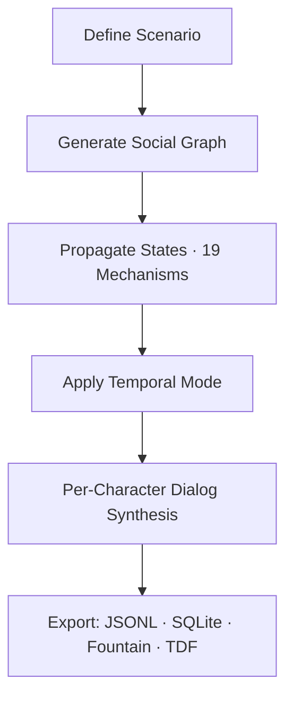

<Info>
**Goal:** Run your first Timepoint Pro simulation and understand the output in under 5 minutes.
</Info>

## Prerequisites

You'll need:
- Python 3.10+ installed
- An OpenRouter API key (free tier available at [openrouter.ai/keys](https://openrouter.ai/keys))
- 5 minutes

## Step 1: Get the Code

<Steps>
  <Step title="Clone the repository">
    ```bash
    git clone https://github.com/timepoint-ai/timepoint-pro.git
    cd timepoint-pro
    ```
  </Step>

  <Step title="Install dependencies">
    ```bash
    pip install -r requirements.txt
    ```

    <Note>
    If you prefer Poetry: `poetry install`
    </Note>
  </Step>

  <Step title="Set your API key">
    Create a `.env` file in the project root:

    ```bash .env
    OPENROUTER_API_KEY=your_key_here
    ```

    <Warning>
    **Critical:** Ensure your API key is on a **single line** with no line breaks. If you see "Illegal header value" errors, check for embedded newlines.
    </Warning>

    Load the environment variables:

    ```bash
    # Export all variables from .env
    export $(cat .env | xargs)

    # Or source directly
    source .env

    # Or set directly (must be ONE line)
    export OPENROUTER_API_KEY="your_key_here"
    ```
  </Step>
</Steps>

## Step 2: Run Your First Simulation

<CodeGroup>
```bash Template-Based (Recommended)
# List all available templates
./run.sh list

# Run a showcase template - board meeting simulation
./run.sh run board_meeting
```

```bash Natural Language
# Describe what you want in plain English
python run_all_mechanism_tests.py --nl "emergency board meeting about a merger"
```

```bash Free Models ($0 cost)
# Test with free-tier models
python run_all_mechanism_tests.py --free --template board_meeting
```
</CodeGroup>

<Info>
**Cost:** Most simulations cost $0.02-$0.10. The `board_meeting` template costs approximately $0.05-$0.10.

Updated February 2026: Costs are ~10x lower than previous estimates due to efficient Llama 4 Scout pricing.
</Info>

## Step 3: Understand the Output

Your simulation generates four key artifacts:

### Terminal Output

You'll see real-time progress:

```bash
================================================================================
TEMPLATE CATALOG
================================================================================
ID                                       TIER           CATEGORY     MECHANISMS
--------------------------------------------------------------------------------
showcase/board_meeting                   standard       showcase     M1, M7, M11 +1
...

[Waveform] Scheduler initialized with 4 entity envelopes
[Waveform] Resolution schedule covers 40 (entity, timepoint) pairs
Generating dialog for tp_004 with 3 entities...
```

### Output Files

Results are saved to `output/simulations/`:

<CardGroup cols={2}>
  <Card title="Summary JSON" icon="file">
    `summary_TIMESTAMP.json` - Full simulation summary with metadata, entity states, and causal graph
  </Card>
  <Card title="Entity Data" icon="users">
    `entities_TIMESTAMP.jsonl` - Line-delimited JSON with detailed entity evolution across timepoints
  </Card>
  <Card title="SQLite Database" icon="database">
    `sim_TIMESTAMP.db` - Complete queryable database with entities, timepoints, relationships, knowledge flow
  </Card>
  <Card title="Training Data" icon="graduation-cap">
    `training_TIMESTAMP.jsonl` - Structured prompt/completion pairs for fine-tuning (when applicable)
  </Card>
</CardGroup>

### What You Get

Each simulation produces:

<Steps>
  <Step title="Entities - Characters with depth">
    - Unique personalities derived from behavior tensors
    - Knowledge states with provenance tracking
    - Roles and relationship networks
    - Cognitive tensors (arousal, valence, energy)
  </Step>

  <Step title="Timepoints - Causal event sequence">
    - Event descriptions with timestamps
    - Entity presence tracking (who was there)
    - Causal links showing what caused what
    - Forward/backward/branching temporal modes
  </Step>

  <Step title="Relationships - Social network graph">
    - How entities relate to each other
    - Social connections and power dynamics
    - Information flow patterns
  </Step>

  <Step title="Knowledge Flow - Exposure events">
    - What each entity knows at each timepoint
    - When and how they learned it
    - Confidence levels for each piece of knowledge
  </Step>
</Steps>

## Step 4: Explore the Results

Check your most recent run:

```bash
# Show the latest run's status
./run.sh status

# View recent runs
./run.sh list runs --limit 5

# Export to markdown for reading
./run.sh export last --format md
```

### Example Output

```bash
Run ID:     run_20260218_091456_55697771
Status:     completed
Template:   board_meeting
Started:    2026-02-18 09:14:56
Duration:   127s
Cost:       $0.0823
Tokens:     89,234
LLM Calls:  47
Entities:   4
Timepoints: 5
```

## What's Happening Under the Hood

Timepoint Pro implements **SNAG (Social Network Augmented Generation)** - the first practical SNAG engine:



<Note>
**SNAG is to social systems what RAG is to documents.**

Like RAG retrieves documents to ground generation, SNAG synthesizes and maintains a structured social graph—complete with causal provenance, knowledge flow, emotional states, and temporal consistency—to ground LLM generation in complex group dynamics.
</Note>

## Next Steps

<CardGroup cols={2}>
  <Card title="Installation Guide" icon="download" href="/installation">
    Set up Poetry, configure API keys, explore advanced options
  </Card>
  <Card title="First Simulation" icon="play" href="/first-simulation">
    Deep dive: understand templates, customize parameters, explore temporal modes
  </Card>
  <Card title="Templates" icon="folder-tree" href="/templates">
    21 production templates from board meetings to Mars missions
  </Card>
  <Card title="API Reference" icon="code" href="/api-reference">
    Programmatic access via REST API
  </Card>
</CardGroup>

## Troubleshooting

<AccordionGroup>
  <Accordion title="Error: OPENROUTER_API_KEY not set">
    **Solution:** Add your API key to `.env` and load it:

    ```bash
    export $(cat .env | xargs)
    ```

    Or set it directly:

    ```bash
    export OPENROUTER_API_KEY="your_key_here"
    ```
  </Accordion>

  <Accordion title="Error: Illegal header value with embedded newlines">
    **Solution:** Your API key has line breaks. Ensure it's on a **single line** in `.env`:

    ```bash .env
    OPENROUTER_API_KEY=sk-or-v1-abc123...xyz
    ```

    When exporting manually, use one line with no breaks:

    ```bash
    export OPENROUTER_API_KEY="your_key_here"
    ```
  </Accordion>

  <Accordion title="Error: ModuleNotFoundError: No module named 'msgspec'">
    **Solution:** Install the missing dependency:

    ```bash
    pip install msgspec
    ```

    Or reinstall all requirements:

    ```bash
    pip install -r requirements.txt
    ```
  </Accordion>

  <Accordion title="Warning: LLM client in dry_run mode">
    **Solution:** Environment variables not loaded. Run before executing:

    ```bash
    export $(cat .env | xargs)
    ```
  </Accordion>

  <Accordion title="Error: OpenRouter API error: 401 - User not found">
    **Solution:** API key is invalid or not loaded.

    1. Verify your key at [openrouter.ai/keys](https://openrouter.ai/keys)
    2. Check `.env` file contains the correct key
    3. Export environment variables: `export $(cat .env | xargs)`
  </Accordion>
</AccordionGroup>

## Quick Command Reference

```bash
# List all templates
./run.sh list

# Run by tier (complexity)
./run.sh quick                    # Fast tests (~2-3 min, <$0.05)
./run.sh standard                 # Moderate (~5-10 min, $0.05-0.20)
./run.sh comprehensive            # Thorough (~15-30 min, $0.20-1.00)

# Run by category
./run.sh run --category showcase  # Production scenarios

# Run specific template
./run.sh run board_meeting
./run.sh run mars_mission_portal

# Natural language
python run_all_mechanism_tests.py --nl "startup board meeting about pivoting"

# Check status
./run.sh status

# View help
./run.sh --help
```

<Info>
**Ready for more?** Continue to the [Installation Guide](/installation) for environment setup and advanced configuration, or jump to [First Simulation](/first-simulation) to explore templates and temporal modes.
</Info>
